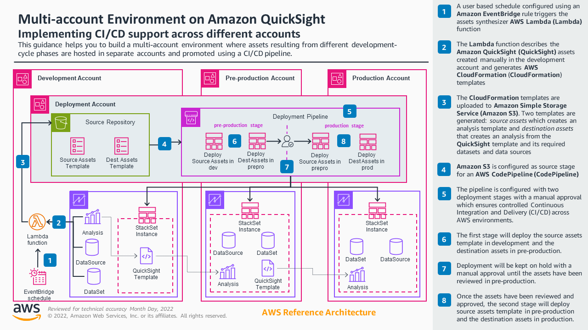

# Multi-account environment for Amazon QuickSight

## Introduction

This repository contains the code needed to deploy the assets that support the  Multi-account Environment on Amazon QuickSight Guidance.

This guidance assets are designed to customers that want to build a multi account architecture for Amazon QuickSight to adhere to the AWS' multi-account best practices (more information [here](https://docs.aws.amazon.com/whitepapers/latest/organizing-your-aws-environment/design-principles-for-your-multi-account-strategy.html)) where it is recommended to have separate AWS accounts (and hence Amazon QuickSight accounts) for each environment. 

This solution details the architecture and steps needed to create a multi-account Amazon QuickSight environment using its API and additional services such as AWS CodePipeline, AWS Cloudformation, Amazon EventBridge and AWS Lambda to automate and orchestrate content promotion across environments (Amazon Quicksight accounts) to reduce operational overhead, auditability and approval steps to prevent non-reviewed changes to reach production environment.

## Core concepts and terminology

### Product and development APIs available

QuickSight is cloud-native, serverless, business intelligence (BI) tool that allows customers to build dashboards in an efficient and scalable way. Each QuickSight account is **associated with one AWS account** meaning that if a user has its environments data and applications (DEV, PRE, PRO ...) in separate accounts QuickSight should also be configured in these accounts. As each QuickSight account is isolated from each other customers need to have scalable and automated processes to promote assets between accounts instead of having to manually create them.

QuickSight provides [a rich set of APIs](https://docs.aws.amazon.com/quicksight/latest/APIReference/Welcome.html) to automate operations. In particular, to copy assets between QuickSight accounts two well differentiated API groups are provided:

#### Templating capabilities, which include

* [CreateTemplate](https://docs.aws.amazon.com/quicksight/latest/APIReference/API_CreateTemplate.html)
* [CreateDatasource](https://docs.aws.amazon.com/cli/latest/reference/quicksight/create-data-source.html) and [DescribeDatasource](https://docs.aws.amazon.com/cli/latest/reference/quicksight/describe-data-source.html)
* [CreateDataset](https://docs.aws.amazon.com/cli/latest/reference/quicksight/create-data-set.html) and [DescribeDataset](https://docs.aws.amazon.com/cli/latest/reference/quicksight/describe-data-set.html)

This will create **exact** copies of the analysis and allow you to replace their underlying datasets in the target account (the target datasets need to contain the same structure and field for the operation to succeed). 

This was the option chosen in this solution as will meet the needs in most of the cases that need promoting assets in a CI/CD between environment (where exact copies need to be done just replacing the underlying datasets).

#### Assets bundling and assets as code capabilities

These particular QuickSight APIs allow programmatic creation and management of dashboards, analysis, and templates. These capabilities allow BI teams to manage their BI assets as code, similar to [IaC](https://en.wikipedia.org/wiki/Infrastructure_as_code). It brings greater agility to BI teams, and it allows them to accelerate BI migrations from legacy products through programmatic migration options.

These are the APIs supporting asset bundling and assets as code capabilities:

* [DescribeDashboardDefinition](https://docs.aws.amazon.com/quicksight/latest/APIReference/API_DescribeDashboardDefinition.html)/[DescribeAnalysisDefinition](https://docs.aws.amazon.com/quicksight/latest/APIReference/API_DescribeAnalysisDefinition.html): Generate a JSON representation of the dashboard/analysis that you can export, store into your CVS and also alter as needed before feeding it into a [CreateAnalysis](https://docs.aws.amazon.com/quicksight/latest/APIReference/API_CreateAnalysis.html)/[CreateDashboard](https://docs.aws.amazon.com/quicksight/latest/APIReference/API_CreateDashboard.html) operation. The JSON includes only the dashboard/analysis definition, if you want to include also depending assets (datasets and datasources) check the *AssetBundleExportJob APIs mentioned below.
* [CreateAnalysis](https://docs.aws.amazon.com/quicksight/latest/APIReference/API_CreateAnalysis.html)/[CreateDashboard](https://docs.aws.amazon.com/quicksight/latest/APIReference/API_CreateDashboard.html): Will use the JSON produced by the aforementioned Describe API calls as input to the Definition parameter to create assets based on it.
* [StartAssetBundleExportJob](https://docs.aws.amazon.com/quicksight/latest/APIReference/API_StartAssetBundleExportJob.html): Allows you to export multiple assets at once also you can choose to include all the dependencies for these. Properties of the assets can be also included so they can be used to parametrize the assets (or the CloudFormation templates generating these assets) 
[StartAssetBundleImportJob](https://docs.aws.amazon.com/quicksight/latest/APIReference/API_StartAssetBundleImportJob.html): Allows you to import multiple assets that were previously exported with StartAssetBundleExportJob. You can now specify a list of [AssetBundleImportJobOverrideParameters](https://docs.aws.amazon.com/quicksight/latest/APIReference/API_AssetBundleImportJobOverrideParameters.html) to override the properties of the assets defined earlier 

These set of APIs while more powerful they are also more more oriented to perform large migrations of multiple assets and their dependencies allowing you to customize the migreated assets as needed (changing the definition programmatically) which is out of the scope of this use case (CI/CD migrating assets as they were defined).

### Terminology

Here you will find definition to specific terms that will be used throughout the document

* **QuickSight Template:** A template is an entity in Amazon QuickSight that encapsulates the metadata required to create an analysis and that you can use to create s dashboard. A template adds a layer of abstraction by using placeholders to replace the dataset associated with the analysis. You can use templates to create dashboards by replacing dataset placeholders with datasets that follow the same schema that was used to create the source analysis and template.
* **Deployment environment/environment**: Defines a set of stages (or environments) with isolated compute resources and data to perform development, validation/test and end customer consumption (production) tasks. A typical development environment will contain at least 3 stages (DEV, PRE and PRO).
* **Continuous integration/Continuous delivery (CI/CD)**: In software engineering, CI/CD is the combined practices of continuous integration (CI) and continuous delivery (CD) or, less often, continuous deployment. They are sometimes referred to collectively as continuous development or continuous software development.
* **Deployment account:** not to be confused with the term defined above. In this case the development account will be an AWS account that will host the resources and configuration needed to ensure CI/CD across the different deployment environments. As per the Organizing Your [AWS Environment Using Multiple Accounts](https://docs.aws.amazon.com/whitepapers/latest/organizing-your-aws-environment/design-principles-for-your-multi-account-strategy.html) it will be hosted in a dedicated AWS account.
* **Deployment pipeline:** Collection of automated processes designed to quickly and accurately move new code/assets additions from the source control to the various stages defined in the pipeline, where each stage represent a single development environment.
* **Deployment Bucket:** S3 bucket belonging to the deployment account that will host the pipeline assets and the artifacts used by the pipeline to deploy your assets across the different stages.


## Pre-requisites and assumptions

* You have an environment with at least has 4 accounts (one for Deployment and then additional ones for the different stages. E.g. Dev, Pre and Pro)
* You are [signed up](https://docs.aws.amazon.com/quicksight/latest/user/signing-up.html) to QuickSight Enterprise edition in the environment stages accounts
* data-sources in the dev account *should be using secrets* for RDS, RDBMSs and Redshift sources. Secrets corresponding to each stage should exist in all the accounts (they will be passed as CFN parameter). For more information take refer to [create an AWS Secrets Manager secret](https://docs.aws.amazon.com/secretsmanager/latest/userguide/create_secret.html)
* If data-sources in the dev account are using a [QuickSight VPC connection](https://docs.aws.amazon.com/quicksight/latest/user/working-with-aws-vpc.html), an equivalent VPC connection *should exist* on the other stages accounts, the id of the vpc connection will be passed as CFN parameter in the deployment action
* Deployment account is the [organization management account](https://docs.aws.amazon.com/organizations/latest/userguide/orgs_getting-started_concepts.html)

## Architecture

### Solution overview and AWS services to use:

**QuickSight:** Cloud-native, serverless, business intelligence (BI) that will allow us to create assets in dev account and automatically progress them to the pre-production and production accounts. In order to perform automation we wil be using [QuickSight APIs](https://docs.aws.amazon.com/quicksight/latest/APIReference/Welcome.html) and its [support in CloudFormation](https://docs.aws.amazon.com/AWSCloudFormation/latest/UserGuide/AWS_QuickSight.html) to manage assets.

**Lambda:** which will allow us to synthesize CloudFormation templates from our assets in development to have them deployed in pre-production and then on production. The lambda function will synthesize CloudFormation templates that are parametrized (so they can be used in any environment stage) and will store the generated  templates in S3 to be referred from the pipeline. There will be two templates generated:


* Source assets template: Responsible for the creation of the QuickSight Template for the asset to be copied over the next phase of the pipeline. Phase dependent variables such as the source account ID, region, QS user name, etc... will be added as [parameters so they can be set (or overridden)](https://docs.aws.amazon.com/AWSCloudFormation/latest/UserGuide/continuous-delivery-codepipeline-action-reference.html) by the different codepipeline phases. This template will be deployed in the Dev account and pre-production account (to template the dashboard present in there).
* Destination assets template: Responsible for the creation of the data-source, Dataset(s), Ingestion schedules (if any) and dashboard in the destination accounts. Phase dependent variables such as the source account ID, region, QS user name, etc... [will be added as parameters so they can be set (or overridden)](https://docs.aws.amazon.com/AWSCloudFormation/latest/UserGuide/continuous-delivery-codepipeline-action-reference.html) by the different codepipeline phases. This template will be deployed in the pre-production  account and Production account (to template the dashboard present in there).

**All the resources across environments will have identical IDs** this is to ensure we can synthesize and use only two CloudFormation templates (source and destination assets) across all the environments relying on CloudFormation parametrization which is a best practice

**S3:** to store the CloudFormation templates generated by lambda and allow CodePipeline to retrieve them to use them as source for the deployment actions

**CodePipeline:** central piece of the solution that, from a centralized deployment account (that will act should be the [organization management account for the organization](https://docs.aws.amazon.com/organizations/latest/userguide/orgs_getting-started_concepts.html)) will be used to deploy via  CloudFormation StackSets on the AWS accounts that correspond to each development stage. 

**CloudFormation:** Infrastructure as code service that will be configured  as an action provider for the Codepipeline deploy actions, deploying assets in the pre-production and production accounts in  an efficient and scalable manner (updating only resources as needed and detecting changes). Two cloudformation templates by stage will be deployed
* **SourceAssets** creates a [QuickSight Template](https://docs.aws.amazon.com/AWSCloudFormation/latest/UserGuide/aws-resource-quicksight-template.html) from the analysis in the previous stage (e.g. Dev) that will be copied over the next one (e.g. Pre), this will be deployed in the *previous* environment as the stage deploying the assets (e.g. Pre stage will deploy SourceAssets in dev account)
* **DestAssets** creates an analysis from the QuickSight template defined in SourceAssets and all the required assets (datasets, data-sources, refresh schedules) needed for it, this will be deployed in the same environment as the stage deploying the assets (e.g. Pre stage will deploy DestAssets in pre account)

To deploy with CodePipeline in the first stage (typically Pre) [StackSets will be used](https://docs.aws.amazon.com/codepipeline/latest/userguide/action-reference-StackSets.html), then for the subsequent stages [StackSet instances](https://docs.aws.amazon.com/codepipeline/latest/userguide/action-reference-StackSets.html#action-reference-StackInstances) (for the same StackSet used earlier) will be used. This is to follow the best practices as mentioned in the [Create a pipeline with AWS CloudFormation StackSets deployment actions tutorial](https://docs.aws.amazon.com/codepipeline/latest/userguide/tutorials-stackset-deployment.html).

**Event Bridge:**  A schedule rule (https://docs.aws.amazon.com/eventbridge/latest/userguide/eb-create-rule-schedule.html) can  be configured to trigger the lambda asset synthesizer so it generates the . The product team is  expecting to support event bridge by re:Invent 23 so once it is supported we should change the solution so event bridge can be responsible of detecting changes that will trigger the actions in the CodePipeline

### Architecture Diagram:



## Deploying the solution

Solution assets will need to be deployed in two of the accounts, the first account that will be used in the CI/CD pipeline (typically this would be the development account) that will synthesize the QuickSight assets and the deployment account that will implement the CI/CD pipeline.

### Deployment account assets

The deployment account will need to have the following assets deployed:

* S3 bucket to host the pipeline assets and also the [CloudFormation artifacts](https://docs.aws.amazon.com/AWSCloudFormation/latest/UserGuide/continuous-delivery-codepipeline-cfn-artifacts.html) that will be used by the CodePipeline to deploy in the environment accounts
* IAM role to be assumed by the first stage account (e.g. development) to upload [CloudFormation artifacts](https://docs.aws.amazon.com/AWSCloudFormation/latest/UserGuide/continuous-delivery-codepipeline-cfn-artifacts.html) so they can be used by the CodePipeline defined in this account
* CodePipeline definition with 2 stages that will deploy assets from an S3 source (defined by the aforementioned CloudFormation artifacts) in these stages. The name of the stages can be customized using the StageNName parameters in CloudFormation.
* CodePipeline role to be used for the 
* [EventBridge rule](https://docs.aws.amazon.com/eventbridge/latest/userguide/eb-rules.html) that will detect changes in the S3 prefix configured for CloudFormation artifacts and will trigger the pipeline
* EventBridge role that will be used in the aforementioned EventBridge rule. This role should have permissions to start the pipeline mentioned earlier

The deployment of these assets can be done by just deploying the deploymentAccount_template.yaml CloudFormation template present in the deployment/CFNStacks directory from this repository.

#### Template Parameters

|Parameter name|Description|Type|
| ---- | ---- | ---- |
|DeploymentAccountId|Account ID for deployment pipeline|String|
|DevelopmentAccountId|Account ID hosting for development environment|String|
|PreProdAccountId|Account ID hosting for preproduction environment|String|
|ProdAccountId|Account ID hosting for production environment|String|
|PipelineS3BucketName|S3 Bucket to use for pipeline assets|String|
|S3Region|Region where the S3 bucket will be hosted|String|
|QuickSightRegion|Region where QuickSight assets are hosted|String|
|SrcQSAdminRegion|Admin region for your QS source account where your users are hosted|String|
|DestQSAdminRegion|Admin region for your QS destination account where your users are hosted|String|
|AccountAdmin|IAM Username that will be responsible for administering the Account (it will be able to manage the created KMS key for encryption)|String|
|QSUser|QS Username in Account where the assets will be created|String|
|Stage1Name|Name of the first stage in the pipeline, e.g. DEV|String|
|Stage2Name|Name of the first stage in the pipeline, e.g. PRE|String|
|Stage3Name|Name of the first stage in the pipeline, e.g. PRO|String|
|AssumeRoleExtId|Ext ID to be used in when assuming the IAM role in the development account|String|
|PipelineName|"Name for the Code Pipeline that will be created"|String|
|CreateBucket|"Decide if pipeline bucket should be created"|String|

### Pipeline first stage account assets

The first stage account in our CI/CD pipeline will need to have the following assets deployed

* Lambda function (QSAssetsCFNSynthesizer), this lambda function will be responsible for synthesizing the QuickSight assets (a given dashboard and all its dependencies) to create CloudFormation templates and configuration files (to parametrize these templates for each environment) and package them as [CloudFormation artifacts](https://docs.aws.amazon.com/AWSCloudFormation/latest/UserGuide/continuous-delivery-codepipeline-cfn-artifacts.html) that can be used by the CodePipeline defined in the deployment account. 
* IAM Role to be used in the Lambda function as execution role. This role will have permissions to execute the QuickSight API calls needed to describe the assets that will be synthesized
* Lambda layer containing 
  * [PyYaml python package](https://pypi.org/project/PyYAML/) needed to generate the CloudFormation templates as YAML files
  * Up to date [boto3](https://boto3.amazonaws.com/v1/documentation/api/latest/index.html) package as some of the new QuickSight API methods are not yet available in the version deployed in Python lambda

## Using the solution

Once you have the solution deployed you will be ready to start using your newly configured pipeline to promote assets from your first account (typically dev) to the next stage accounts.

In order to do so you just need to follow this procedure:

1. Identify the asset (the QuickSight dashboard) that you wan to promote to the next development stage
1. Ensure that the accounts from subsequent stages are subscribed to QuickSight Enterprise edition.
1. If your dashboard uses data-sources that require a user and a password for authentication, make sure you configure these to make use of AWS Secrets Manager instead of user credentials, [more info here](https://docs.aws.amazon.com/quicksight/latest/user/secrets-manager-integration.html). Create secrets in all the accounts from subsequent stages.
1. If your dashboard uses data-sources that require a [VPC connection](https://docs.aws.amazon.com/quicksight/latest/user/working-with-aws-vpc.html) make sure that an equivalent VPC connection is already configured on all the accounts from subsequent stages.
1. Execute the lambda function present in the development account setting the arguments (see table below) according to your needs. The first time you run the lambda function you should use 'MODE': 'INITIALIZE'. This will make the lambda function to scan the resources that need to be synthesized in the source account and will create CloudFormation parameter configuration files in the deployment S3 bucket (a pair of files for each stage will be created, one for source assets and another one for destination assets). A parameter file will look like this:

```json
[
  {
    "ParameterKey": "DestAccountID",
    "ParameterValue": "<fill_me>"
  },
  {
    "ParameterKey": "QSUser",
    "ParameterValue": "<fill_me>"
  },
  {
    "ParameterKey": "SrcQSAdminRegion",
    "ParameterValue": "<fill_me>"
  }
]
```
6. Locate the generated files in S3 (the lambda function will output the location of these files upon execution) and edit the contents to parametrize the deployment on the subsequent stages (typically PRE and PRO). If you have provided the 'REMAP_DS' argument to the lambda function you will also need to define the data-source configuration parameters for each stage. e.g.

```json
[
  {
    "ParameterKey": "SourceAccountID",
    "ParameterValue": "<fill_me>"
  },
  {
    "ParameterKey": "QSUser",
    "ParameterValue": "<fill_me>"
  },
  {
    "ParameterKey": "DstQSAdminRegion",
    "ParameterValue": "<fill_me>"
  },
  {
    "ParameterKey": "SrcQSRegion",
    "ParameterValue": "<fill_me>"
  },
  {
    "ParameterKey": "VpcConnectionArn",
    "ParameterValue": "<fill_me>"
  },
  {
    "ParameterKey": "DSSecretArn",
    "ParameterValue": "<fill_me>"
  },
  {
    "ParameterKey": "RDSInstanceID0",
    "ParameterValue": "<fill_me>"
  },
  {
    "ParameterKey": "RDSDBName0",
    "ParameterValue": "<fill_me>"
  },
  {
    "ParameterKey": "REDSHIFTDBName1",
    "ParameterValue": "<fill_me>"
  },
  {
    "ParameterKey": "REDSHIFTPort1",
    "ParameterValue": "1234"
  },
  {
    "ParameterKey": "REDSHIFTHost1",
    "ParameterValue": "<fill_me>"
  },
  {
    "ParameterKey": "REDSHIFTClusterId1",
    "ParameterValue": "<fill_me>"
  }
]
```
7. Once you have edited the parameter files for each stage upload the edited files to the same location in S3 and then execute the lambda function using 'MODE': 'DEPLOY'. This will create the [CloudFormation artifacts](https://docs.aws.amazon.com/AWSCloudFormation/latest/UserGuide/continuous-delivery-codepipeline-cfn-artifacts.html) and upload them to the deployment S3 bucket monitored by EventBridge that will trigger the execution of the pipeline
7. Check the pipeline execution and the deployment in your second stage (typically PRE), once the deployment is complete navigate to the quicksight  console in your region to see the deployed analysis.
7. Once you have validated the analysis in the first stage you may go back to the pipeline and decide whether or not you want to approve the change so it reaches the second stage (typically PRO)
7. After changes have been approved you should be able to see the deployment started that will progress your changes to PRO

### Lambda function event arguments

The lambda function will accept the following parameters as part of the [lambda event](https://docs.aws.amazon.com/lambda/latest/dg/gettingstarted-concepts.html#gettingstarted-concepts-event)

|Argument|Description|Possible values|Required|
| ---- | ---- | ---- | ---- |
|DASHBOARD_ID|The dashboard ID that will be synthesized|A valid dashboard id|YES|
|PIPELINE_NAME|The name of the CodePipeline that should be used for this asset (this allows you to define multiple pipelines for different dashboards)|An existing pipeline name in your account|NO|
|REMAP_DS|Remap data-sources, whether or not you want to define different connections for your datasources across different stages. E.g. preprohost.com for PRE database and prodhost.com for PRO database |Any value will enable this setting|NO|
|MODE|The lambda function has two modes of operation, INITIALIZE and DEPLOY. When INITIALIZE is set the lambda will scan all the QuickSight resources in your first stage account and will generate a configuration file with a list of parameters |YES|


## Security

See [CONTRIBUTING](CONTRIBUTING.md#security-issue-notifications) for more information.

## License

This library is licensed under the MIT-0 License. See the LICENSE file.

