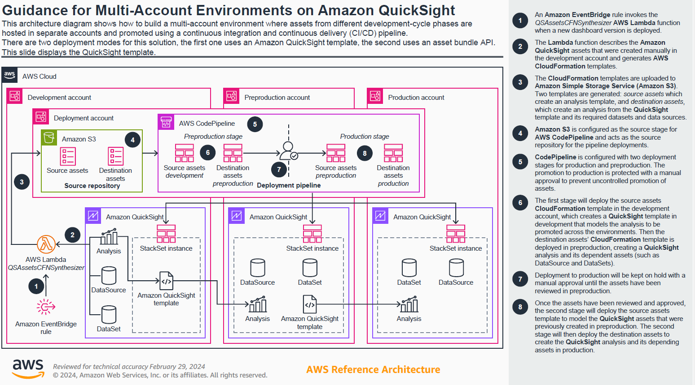

# Guidance for Multi-account environment for Amazon QuickSight

## Table of Contents

1. [Introduction](#introduction)
1. [Core concepts and terminology](#core-concepts-and-terminology)
1. [Architecture](#architecture)
    - [Guidance overview and AWS services to use](#guidance-overview-and-aws-services-to-use)
    - [Architecture Diagram](#architecture-diagram)
1. [Deploying the guidance](#deploying-the-guidance)
    - [re-requisites and assumptions](#pre-requisites-and-assumptions)
    - [Preparing deployment using the helper script](#preparing-deployment-using-the-helper-script)
    - [Deploying _Deployment account_ assets](#deploying-deployment-account-assets)
    - [Deploying _Development a.k.a. first stage account_ assets](#deploying-development-aka-first-stage-account-assets)
1. [Using the guidance](#using-the-guidance)
1. [Guidance limitations](#guidance-limitations)
1. [Cleaning up](#cleaning-up)
1. [FAQ/Troubleshooting](#faqtroubleshooting)
1. [Contributing](#contributing)
1. [License](#license)

## Introduction

This repository contains the code needed to deploy the assets that support the  Multi-account Environment on Amazon QuickSight Guidance.

This guidance assets are designed to customers that want to build a multi account architecture for Amazon QuickSight to adhere to the AWS' multi-account best practices (more information [here](https://docs.aws.amazon.com/whitepapers/latest/organizing-your-aws-environment/design-principles-for-your-multi-account-strategy.html)) where it is recommended to have separate AWS accounts (and hence Amazon QuickSight accounts) for each environment. 

This guidance details the architecture and steps needed to create a multi-account Amazon QuickSight environment using its API and additional services such as AWS CodePipeline, AWS Cloudformation, Amazon EventBridge and AWS Lambda to automate and orchestrate content promotion across environments (Amazon Quicksight accounts) to reduce operational overhead, auditability and approval steps to prevent non-reviewed changes to reach production environment.

The guidance assumes you already have an account setup with at least three AWS accounts plus an account used for deployment. This guidance is implemented by a set of AWS resources that are deployed via CloudFormation. The accounts should belong to an AWS Organization and should be configured to operate with [CloudFormation StackSets using self managed permissions](https://docs.aws.amazon.com/AWSCloudFormation/latest/UserGuide/stacksets-prereqs-self-managed.html). There are two different templates that need to be deployed one if your deployment account and the other one in the CI/CD first stage (typically DEV account)

Looking forward to get started with the deployment of the guidance? Below you can see a description of the guidance, architecture and key concepts that are recommended to read before deployment, however if you want to skip them just move to the section named "Deploying the guidance".

## Core concepts and terminology

### Product and development APIs available

QuickSight is cloud-native, serverless, business intelligence (BI) tool that allows customers to build dashboards in an efficient and scalable way. Each QuickSight account is **associated with one AWS account** meaning that if a user has its environments data and applications (DEV, PRE, PRO ...) in separate accounts QuickSight should also be configured in these accounts to ensure isolation and reduce blast radius in case of potential misconfigurations. As each QuickSight account is isolated from each other customers need to have scalable and automated processes to promote assets between accounts instead of having to manually create them.

QuickSight provides [a rich set of APIs](https://docs.aws.amazon.com/quicksight/latest/APIReference/Welcome.html) to automate operations. In particular, to copy assets between QuickSight accounts two well differentiated API groups are provided:

#### Templating capabilities, which include

* [CreateTemplate](https://docs.aws.amazon.com/quicksight/latest/APIReference/API_CreateTemplate.html): Allows you to define a template from an analysis including placeholders for each of its datasets (so they can be used on the destination account to replace the local datasets)
* [CreateAnalysis](https://docs.aws.amazon.com/quicksight/latest/APIReference/API_CreateAnalysis.html): Where you can specify a template as [SourceEntity](https://docs.aws.amazon.com/quicksight/latest/APIReference/API_CreateAnalysis.html#QS-CreateAnalysis-request-SourceEntity) to create an analysis passing the destination account datasets on the template placeholders.
* [CreateDashboard](https://docs.aws.amazon.com/quicksight/latest/APIReference/API_CreateDashboard.html): Where you can specify a template as [SourceEntity](https://docs.aws.amazon.com/quicksight/latest/APIReference/API_CreateDashboard.html#QS-CreateDashboard-request-SourceEntity) to create a dashboard passing the destination account datasets on the template placeholders.

This will create **exact** copies of the analysis and allow you to replace their underlying datasets in the target account (the target datasets need to contain the same structure and field for the operation to succeed). 

#### Assets bundling and assets as code capabilities

These particular QuickSight APIs allow programmatic creation and management of dashboards, analysis, and templates. These capabilities allow BI teams to manage their BI assets as code, similar to [IaC](https://en.wikipedia.org/wiki/Infrastructure_as_code). It brings greater agility to BI teams, and it allows them to accelerate BI migrations from legacy products through programmatic migration options.

These are the APIs supporting asset bundling and assets as code capabilities:

* [DescribeDashboardDefinition](https://docs.aws.amazon.com/quicksight/latest/APIReference/API_DescribeDashboardDefinition.html)/[DescribeAnalysisDefinition](https://docs.aws.amazon.com/quicksight/latest/APIReference/API_DescribeAnalysisDefinition.html): Generate a JSON representation of the dashboard/analysis that you can export, store into your CVS and also alter as needed before feeding it into a [CreateAnalysis](https://docs.aws.amazon.com/quicksight/latest/APIReference/API_CreateAnalysis.html)/[CreateDashboard](https://docs.aws.amazon.com/quicksight/latest/APIReference/API_CreateDashboard.html) operation. The JSON includes only the dashboard/analysis definition, if you want to include also depending assets (datasets and datasources) check the *AssetBundleExportJob APIs mentioned below.
* [CreateAnalysis](https://docs.aws.amazon.com/quicksight/latest/APIReference/API_CreateAnalysis.html)/[CreateDashboard](https://docs.aws.amazon.com/quicksight/latest/APIReference/API_CreateDashboard.html): Will use the JSON produced by the aforementioned Describe API calls as input to the Definition parameter to create assets based on it.
* [StartAssetBundleExportJob](https://docs.aws.amazon.com/quicksight/latest/APIReference/API_StartAssetBundleExportJob.html): Allows you to export multiple assets at once also you can choose to include all the dependencies for these. Properties of the assets can be also included so they can be used to parametrize the assets (or the CloudFormation templates generating these assets) 
[StartAssetBundleImportJob](https://docs.aws.amazon.com/quicksight/latest/APIReference/API_StartAssetBundleImportJob.html): Allows you to import multiple assets that were previously exported with StartAssetBundleExportJob. You can now specify a list of [AssetBundleImportJobOverrideParameters](https://docs.aws.amazon.com/quicksight/latest/APIReference/API_AssetBundleImportJobOverrideParameters.html) to override the properties of the assets defined earlier 

These set of APIs while more powerful they are also more more oriented to perform large migrations of multiple assets and their dependencies allowing you to customize the migrated assets as needed (changing the definition programmatically) which is out of the scope of this use case (CI/CD migrating assets as they were defined).

The guidance supports using any of two different methods for promoting assets between accounts. [Templating](https://aws.amazon.com/blogs/big-data/migrate-amazon-quicksight-across-aws-accounts/) and [Assets as Bundle operations](https://aws.amazon.com/blogs/business-intelligence/automate-and-accelerate-your-amazon-quicksight-asset-deployments-using-the-new-apis/). The selection of the method to use can be parametrized in the AWS Lambda function that generates the assets used by the deployment pipeline so customers can choose the method that better aligns to their needs.

### Terminology

Here you will find definition to specific terms that will be used throughout the document

* **QuickSight Template:** [A template](https://docs.aws.amazon.com/quicksight/latest/developerguide/template-operations.html) is an entity in Amazon QuickSight that encapsulates the metadata required to create an analysis and that you can use to create s dashboard. A template adds a layer of abstraction by using placeholders to replace the dataset associated with the analysis. You can use templates to create dashboards by replacing dataset placeholders with datasets that follow the same schema that was used to create the source analysis and template.
* **Asset as bundle operations:** [Assets as Bundle (AAaB) operations](https://docs.aws.amazon.com/quicksight/latest/developerguide/asset-bundle-ops.html) are a set of APIs that allow you initiate, track, and describe the export jobs that produce the bundle files from the source account. A bundle file is a zip file (with the .qs extension) that contains assets specified by the caller (typically analysis and dashboards) and also packs along the dependencies (e.g. datasources, datasets, themes, vpc configurations ...) that are used by the assets being exported. Asset bundle operations can be used to back up or restore deleted work, promote new work into a production account, or to duplicate assets within the same account or across different accounts.
* **Deployment environment/environment**: Defines a set of stages (or environments) with isolated compute resources and data to perform development, validation/test and end customer consumption (production) tasks. A typical development environment will contain at least 3 stages (DEV, PRE and PRO).
* **Continuous integration/Continuous delivery (CI/CD)**: In software engineering, CI/CD are the combined practices of continuous integration (CI) and continuous delivery (CD) or, less often, continuous deployment. They are sometimes referred to collectively as continuous development or continuous software development.
* **Deployment account:** not to be confused with the term defined above. In this case the deployment account will be an AWS account that will host the resources and configuration needed to ensure CI/CD across the different deployment environments. As per the best practices defined in [AWS Environment Using Multiple Accounts whitepaper](https://docs.aws.amazon.com/whitepapers/latest/organizing-your-aws-environment/design-principles-for-your-multi-account-strategy.html) it should be hosted in a dedicated AWS account.
* **Deployment pipeline:** Collection of automated processes designed to quickly and accurately move new code/assets additions from the source control to the various stages defined in the pipeline, where each stage represent a single development environment.
* **Deployment Bucket:** S3 bucket belonging to the deployment account that will host the pipeline assets and the artifacts used by the pipeline to deploy your assets across the different stages.

## Architecture

### Guidance overview and AWS services to use:

#### QuickSight:

Cloud-native, serverless, business intelligence (BI) that will allow us to create assets in dev account and automatically progress them to the pre-production and production accounts. In order to perform automation we wil be using [QuickSight APIs](https://docs.aws.amazon.com/quicksight/latest/APIReference/Welcome.html) and its [support in CloudFormation](https://docs.aws.amazon.com/AWSCloudFormation/latest/UserGuide/AWS_QuickSight.html) to manage assets.

#### EventBridge

EventBridge makes it easier to build event-driven applications at scale using events generated from your applications, integrated SaaS applications, and AWS services. 

In our solution we use EventBridge to trigger our automation (the synthesizer Lambda function and the CI/CD pipeline). In first place, the synthesizer lambda function its triggered when a new version of a dashboard is created, this function will generate a set of files that will be stored in S3 that also will trigger the deployment of the CI/CD pipeline (in AWS CodePipeline) that is also integrated with EventBridge (in this case watching for new files created in S3).

#### Lambda:

The QSAssetsCFNSynthesizer lambda function is executed each time a new dashboard version is created in our Development account (via EventBridge rule that is created as part of the initial deployment), then it will check the QSTrackedAssets DynamoDB table to see if its a tracked asset, in case it is, it will run synthesizing in a CloudFormation template from our QS assets present in development. The QSAssetsCFNSynthesizer lambda function will generate deployment assets (CFN templates) that will be uploaded to S3 triggering a AWS CodePipeline pipeline that will have them deployed in pre-production and then in production. The lambda generates CloudFormation templates that are **nested and parametrized** (so they can be used in any environment stage) and also prevent reaching the limits of CFN template size (1MB when using S3). The lambda function will generate two different templates generated:

* Source assets template: 
  * If `TEMPLATE` deployment method is selected: the source asset CloudFormation template will be creating a QuickSight Template from the source analysis in Dev stage so the asset to be copied over the next phase of the pipeline. Phase dependent variables such as the source account ID, region, QS user name, etc... will be added as [parameters so they can be set (or overridden)](https://docs.aws.amazon.com/AWSCloudFormation/latest/UserGuide/continuous-delivery-codepipeline-action-reference.html) by the different codepipeline phases. This template will be automatically deployed in the Dev account and pre-production account (to templatize the dashboard created in this stage).
  * If `ASSETS_AS_BUNDLE` deployment method is selected: the source asset CloudFormation template will be using a dummy CloudFormation template that won't be deploying any assets to the source account.
* Destination assets template: Responsible for the creation of the data-source, data-set(s), ingestion schedules (if any) and dashboard in the destination accounts. Phase dependent variables such as the source account ID, region, QS user name, etc... [will be added as parameters so they can be set (or overridden)](https://docs.aws.amazon.com/AWSCloudFormation/latest/UserGuide/continuous-delivery-codepipeline-action-reference.html) by the different codepipeline phases. This template will be deployed in the pre-production  account and Production account (to template the dashboard present in there).
  * If `TEMPLATE` deployment method is selected: it will contain all the required assets (data-sources, data-sets, refresh schedules ...) needed by the templated analysis that will be created. Also VPC connections and secret ARNs for data-sources (if any) will be added as parameters
  * If `ASSETS_AS_BUNDLE` deployment method is selected: the template will contain the output (in CloudFormation syntax from the [StartAssetBundleExportJob](https://docs.aws.amazon.com/quicksight/latest/APIReference/API_StartAssetBundleExportJob.html#QS-StartAssetBundleExportJob-request-ExportFormat) operation)

All the resources across environments will have identical IDs this is to ensure we can synthesize and use only two CloudFormation templates (source and destination assets) across all the environments relying on CloudFormation parametrization which is a best practice

#### S3:

Used to store the CloudFormation templates generated by lambda and allow CodePipeline to retrieve them to use them as source for the deployment actions

#### CodePipeline:

Central piece of the guidance that, from a centralized deployment account (that will act should be the [organization management account for the organization](https://docs.aws.amazon.com/organizations/latest/userguide/orgs_getting-started_concepts.html)) will be used to deploy via  CloudFormation StackSets on the AWS accounts that correspond to each development stage. 

[Parameter overrides](https://docs.aws.amazon.com/codepipeline/latest/userguide/action-reference-CloudFormation.html) are used in each stage to define environment dependent variables in CloudFormation such as the account ID, data-source connection strings, etc ...

#### DynamoDB

We will be using two DynamoDB auxiliary tables:

* QSTrackedAssets to register the QS assets (only dashboards are supported right now) that our CodePipeline pipeline will track across the different stages
* QSAssetParameters where we can to store and configure the different parameter values that our tracked resources in QSTrackedAssets need and their values for each deployment stage (DEV/PRE/PRO). For example if one of our dashboards uses a RDS database the host/port combination would be different in each of the stages so we need to be able to configure these values for them.

#### CloudFormation:

Service that allows us to define our infrastructure as code. This service  will be configured  as an action provider for the Codepipeline deploy actions, deploying assets in the pre-production and production accounts in  an efficient and scalable manner (updating only resources as needed and detecting changes). Two cloudformation templates by stage will be deployed
* **SourceAssets** If `TEMPLATE` was selected as deployment method, creates a [QuickSight Template](https://docs.aws.amazon.com/AWSCloudFormation/latest/UserGuide/aws-resource-quicksight-template.html) from the analysis in the previous stage (e.g. Dev) that will be copied over the next one (e.g. PRE), this will be deployed in the *previous* environment as the stage deploying the assets (e.g. PRE stage will deploy SourceAssets in dev account). If `ASSETS_AS_BUNDLE` was selected as deployment method a dummy template with no resources is used to fit the placeholder in the CodePipeline.
* **DestAssets** creates an analysis from the QuickSight template defined in SourceAssets and all the required assets (datasets, data-sources, refresh schedules) needed for it, this will be deployed in the same environment as the stage deploying the assets (e.g. PRE stage will deploy DestAssets in pre account)

To deploy with CodePipeline in the first stage (typically PRE) [StackSets will be used](https://docs.aws.amazon.com/codepipeline/latest/userguide/action-reference-StackSets.html), then for the subsequent stages [StackSet instances](https://docs.aws.amazon.com/codepipeline/latest/userguide/action-reference-StackSets.html#action-reference-StackInstances) (for the same StackSet used earlier) will be used. This is to follow the best practices as mentioned in the [Create a pipeline with AWS CloudFormation StackSets deployment actions tutorial](https://docs.aws.amazon.com/codepipeline/latest/userguide/tutorials-stackset-deployment.html).

All these templates are parametrized so the same template could be used for all the environments (DEV/PRE/PRO), the parameter values for each stage are retrieved at pipeline execution runtime based on the values configured in DynamoDB tables, [refer to DynamoDB section](#dynamodb) for more details.

#### Event Bridge:

As [QuickSight is integrated with EventBridge](https://aws.amazon.com/blogs/business-intelligence/automate-your-amazon-quicksight-assets-deployment-using-the-new-amazon-eventbridge-integration/), this guidance automatically configures an [Event Bridge rule](https://docs.aws.amazon.com/eventbridge/latest/userguide/eb-rules.html) that triggers the synthesizer Lambda function each time a new dashboard is published or updated. The Lambda synthesizer function uses an environment variable where to specify the dashboard_id to monitor for changes to propagate through the pipeline. This prevents the pipeline to deploy changes from other dashboards that are updated in the development account.

### Architecture Diagram:

#### When Template is used as replication mode:



#### Wen Assets as Bundle is used as replication mode:


## Deploying the guidance

Guidance assets will need to be deployed in two of the accounts, the first account that will be used in the CI/CD pipeline (typically this would be the **development account**) that will synthesize the QuickSight assets and the **deployment account** that will implement the CI/CD pipeline. As the CloudFormation stacks that implement this guidance contain a considerable number of parameters a helper script (deploy.py) is provided so you can quickly configure and deploy the guidance. Refer to the [Preparing deployment using helper script section](#preparing-deployment-using-the-helper-script) for more details.

### Pre-requisites and assumptions

* You have an environment with at least has 4 accounts (one for Deployment and then additional ones for the different stages. E.g. Dev, PRE and PRO)
* You are [signed up](https://docs.aws.amazon.com/quicksight/latest/user/signing-up.html) to QuickSight Enterprise edition in the environment stages accounts
* Your accounts are part of an [AWS Organization](https://docs.aws.amazon.com/organizations/latest/userguide/orgs_introduction.html) with [all features enabled](https://docs.aws.amazon.com/organizations/latest/userguide/
* You have [CloudFormation StackSets](https://us-east-1.console.aws.amazon.com/organizations/v2/home/services/CloudFormation%20StackSets) service configured within your AWS Organization and you have performed the steps to enable self-service operation, [refer to this guide to see the steps](https://docs.aws.amazon.com/AWSCloudFormation/latest/UserGuide/stacksets-prereqs-self-managed.html#stacksets-prereqs-accountsetup). In case you have not completed these steps you will need to
  * Enable [CloudFormation StackSets](https://us-east-1.console.aws.amazon.com/organizations/v2/home/services/CloudFormation%20StackSets) service in the AWS Organizations service console.
  * Create the AdministrationRole in the admin account using the toggle option in deploymentAccount_template.yaml template 
  * Create the ExecutionRole **in each of the stages accounts**, you can use the provided AWSCloudFormationStackSetExecutionRole.yml stack for this.
* Data-sources in the Dev account *should be using secrets* for RDS, RDBMs and Redshift sources. Secrets corresponding to each stage should exist in all the target accounts (they will be passed as CFN parameter). For more information take refer to [create an AWS Secrets Manager secret](https://docs.aws.amazon.com/secretsmanager/latest/userguide/create_secret.html)
* (only when using `TEMPLATE` as deployment method) If data-sources in the dev account are using a [QuickSight VPC connection](https://docs.aws.amazon.com/quicksight/latest/user/working-with-aws-vpc.html), an equivalent VPC connection *should exist* on the other stages accounts, the id of the vpc connection will be passed as CFN parameter in the deployment action
orgs_manage_org_support-all-features.html).
* Deployment account is the [organization management account](https://docs.aws.amazon.com/organizations/latest/userguide/orgs_getting-started_concepts.html). While using [delegated administrator accounts](https://docs.aws.amazon.com/AWSCloudFormation/latest/UserGuide/stacksets-orgs-delegated-admin.html) is now supported when using CloudFormation StackSet operations in CodePipeline it doesn't fully support all the features of this solution such as deploying to individual accounts (instead of OUs) or using nested stacks.

This guidance requires (at least) do deploy two CloudFormation stacks:

1. deploymentAccount_template.yaml that should be deployed on the _Deployment account_
1. firstStageAccount_template.yaml that should be deployed on the _Development account_

The stack files can be found under deployment/CFNStacks/ directory in this Guidance Package.

If you don't have your Organization member accounts configured to operate in self-managed mode with CloudFormation StackSets you will also need to deploy the AWSCloudFormationStackSetExecutionRole.yml template **in all the AWS accounts where you have pipeline stages**. The template can be found in the deployment/CFNStacks/ folder.

### Preparing deployment using the helper script

Under the root folder of this guidance you can find a python script that helps you to customize the cloudformation templates that implement the guidance with your environment values and also uploads the template and the lambda code to an S3 bucket so you can deploy it with one click. Notice that in order to support one click deployment with the script you need to provide a valid S3 bucket you have write access to and this bucket needs to have static webhosting with public access enabled.

#### Using the script

The script takes a number of parameters (some of them are optional) to set the default values of the CloudFormation templates in accordance with your needs, then the script uploads both the CloudFormation templates and the code files referenced by them to create the Lambda function to your bucket and then provides three links, one to be used in the _Deployment account_, one to be used in the _Development a.k.a. first stage account_ and another one to be used in each of the development stages accounts in case you need to create the IAM role to implement delegated access for the AWS CloudFormation Stack Sets operations.

NOTE: The helper script uses [PyYAML](https://pypi.org/project/PyYAML/) library which is not part of the Python Standard libraries so you might need to install it, you can to it easily by executing ```pip install pyyaml```

Now, you can check the parameters supported by the script by executing:

```
python deploy.py -h
```

Below you can find an execution example for the script:

```
python deploy.py --bucket <your_bucket_to_host_code_and_templates> --bucket_account_id <account_id_owning_bucket> --template_prefix templates --code_prefix code --bucket_region us-east-1 --deployment_account_id <your_deployment_account_id> --development_account_id <your_development_account_id>  --prepro_account_id <your_prepro_account_id>  --production_account_id <your_production_account_id>  --pipeline_name QSCICDPipeline
```

### Deploying _Deployment account_ assets

The deployment account will need to have the following assets deployed:

* S3 bucket to host the pipeline assets and also the [CloudFormation artifacts](https://docs.aws.amazon.com/AWSCloudFormation/latest/UserGuide/continuous-delivery-codepipeline-cfn-artifacts.html) that will be used by the CodePipeline to deploy in the environment accounts
* IAM role to be assumed by the first stage account (e.g. development) to upload [CloudFormation artifacts](https://docs.aws.amazon.com/AWSCloudFormation/latest/UserGuide/continuous-delivery-codepipeline-cfn-artifacts.html) so they can be used by the CodePipeline defined in this account
* CodePipeline definition with 2 stages that will deploy assets from an S3 source (defined by the aforementioned CloudFormation artifacts) in these stages. The name of the stages can be customized using the StageNName parameters in CloudFormation.
* CodePipeline role to be used for executing the different actions in the pipeline
* [EventBridge rule](https://docs.aws.amazon.com/eventbridge/latest/userguide/eb-rules.html) that will detect changes in the S3 prefix configured for CloudFormation artifacts and will trigger the pipeline
* EventBridge role that will be used in the aforementioned EventBridge rule. This role should have permissions to start the pipeline mentioned earlier
* (Optional) [AdministrationRole to be used by StackSet operations](https://docs.aws.amazon.com/AWSCloudFormation/latest/UserGuide/stacksets-prereqs-self-managed.html#stacksets-prereqs-accountsetup) to deploy in the staging AWS accounts (this is only needed if you haven't configured IAM delegated access for StackSet operations in your organization yet.)

The deployment of these assets can be done by just deploying the deploymentAccount_template.yaml CloudFormation template present in the deployment/CFNStacks directory from this repository. For convenience default values were provided for most of the parameters.

**IMPORTANT NOTE:** Ensure [CloudFormation StackSets integration](https://us-east-1.console.aws.amazon.com/cloudformation/home?region=us-east-1#/stacksets) is enabled and your account is configured to operate with Stack Sets as mentioned in [requisite 4. in the list of pre-requisites](#pre-requisites-and-assumptions).

#### Template Parameters

Remember that you can use the deployment helper script to customize the template according to your environment and then easily deploy the stack. Refer to the [Preparing deployment using helper script section](#preparing-deployment-using-the-helper-script) for more details.

|Parameter name|Description|Type|Default Value|
| ---- | ---- | ---- |---- |
|DevelopmentAccountId|Account ID hosting for development environment|String| User defined|
|PreProdAccountId|Account ID hosting for pre-production environment|String| User defined|
|ProdAccountId|Account ID hosting for production environment|String| User defined|
|PipelineS3BucketName|S3 Bucket to use for pipeline assets|String| qs-pipeline-bucket |
|S3Region|Region where the S3 bucket will be hosted|String| us-east-1 |
|QuickSightRegion|Region where QuickSight assets are hosted|String|  us-east-1 |
|AccountAdmin|IAM ARN that will be responsible for administering the Account (it will be able to manage the created KMS key for encryption). Eg your role/user arn |String| User defined|
|Stage2Name|Name of the first stage in the pipeline, e.g. PRE|String| PRE |
|Stage3Name|Name of the first stage in the pipeline, e.g. PRO|String| PRO |
|AssumeRoleExtId|IAM external ID to be used in when assuming the IAM role in the development account. [Refer to this link](https://a.co/47mgPwV) for more details|String| qsdeppipeline |
|PipelineName|Name for the Code Pipeline that will be created|String|  QSCICDPipeline|
|ApprovalEmail|Email that you want to be notified for the prod approval phase|String| user@domain.com|
|AdministrationRoleName|The name of the administration role. Defaults to 'AWSCloudFormationStackSetAdministrationRole'.|String| AWSCloudFormationStackSetAdministrationRole|
|ExecutionRoleName|The name of the execution role that can assume this role. Defaults to 'AWSCloudFormationStackSetExecutionRole'.|String| AWSCloudFormationStackSetExecutionRole|
|CreateBucket|Decide if pipeline bucket should be created|String| TRUE|
|CreateAdmRole|Whether or not the Admin role for self managed stack set operations should be created, choose NO if your admin account already have this role created, [more info here](https://a.co/e6M6aMV). Remember that you will need to deploy the provided AWSCloudFormationStackSetExecutionRole.yml stack in ALL the stage accounts|String| TRUE|

### Deploying _Development a.k.a. first stage account_ assets

The first stage account in our CI/CD pipeline will need to have the following assets deployed. 

* Lambda function (QSAssetsCFNSynthesizer), this lambda function will be responsible for synthesizing the QuickSight assets (a given dashboard and all its dependencies) to create CloudFormation templates and configuration files (to parametrize these templates for each environment) and package them as [CloudFormation artifacts](https://docs.aws.amazon.com/AWSCloudFormation/latest/UserGuide/continuous-delivery-codepipeline-cfn-artifacts.html) that can be used by the CodePipeline defined in the deployment account. The code of the lambda is available at lambda/qs_assets_CFN_synthesizer/. You will need to package it in a zip using the aforementioned directory as base directory and  upload it to one of your buckets so it can be referenced in the CloudFormation template below. Alternatively you can use the deploy.py script to package and upload the code (and Cloud Formation templates) to S3 on your behalf, refer to the [Preparing deployment using the helper script section](#preparing-deployment-using-the-helper-script) for more details.
* IAM Role to be used in the Lambda function as execution role. This role will have permissions to execute the QuickSight API calls needed to describe the assets that will be synthesized
* Lambda layer containing (zip is already created and available in  source/layer/lambdaLayerBotoYAML.zip). It will need to be uploaded to one of your buckets and be referenced in the CloudFormation template below.
  * [PyYaml python package](https://pypi.org/project/PyYAML/) needed to generate the CloudFormation templates as YAML files
  * Up to date [boto3](https://boto3.amazonaws.com/v1/documentation/api/latest/index.html) package as some of the new QuickSight API methods are not yet available in the version deployed in Python lambda
* [EventBridge rule](https://docs.aws.amazon.com/eventbridge/latest/userguide/eb-rules.html) that will trigger the Lambda synthesizer function each time a new QuickSight dashboard is published

#### Template parameters

 For convenience default values were provided for most of the parameters. Remember that you can use the deployment helper script to customize the template according to your environment and then easily deploy the stack. Refer to the [Preparing deployment using helper script section](#preparing-deployment-using-the-helper-script) for more details.

 
|Parameter name|Description|Type|Default Value|
| ---- | ---- | ---- |---- |
|AssumeRoleExtId|Ext ID to be used in when assuming the IAM role in the development account|String| qsdeppipeline |
|DeploymentAccountId|Account ID used for the deployment pipelines|String| User defined|
|DeploymentS3Bucket|S3 Bucket to use for pipeline assets|String| qs-pipeline-bucket |
|QuickSightRegion|Region where QuickSight assets are hosted|String|  us-east-1|
|DeploymentS3Region|Region where the deployment (CI/CD) bucket resides|String| us-east-1|   
|LayerCodeKey| Key within S3 Bucket that contains the zipped code for the lambda layer with external libraries. For your convenience you have the source code zipped in the guidance under source/lambda/layer folder| String| User defined|
|PipelineName | Name of the Code Pipeline whose source assets this lambda will be contributing to | String| QSCICDPipeline|
|RemapDS | Whether or not to remap the data sources connection properties in the dashboard datasets (when using templates) or supported properties when using Assets As Bundle (more info here https://a.co/jeHZkOr)| String (YES/NO)| YES|
|GenerateNestedStacks | Whether or not to generate CFN nested stacks to be used by code pipeline CAUTION, this setting helps circumvent the potential issue of reaching the max template size (1MB) but can also break the resulting template, disable it if you experience any issues wit CFN during pipeline deployments| String (YES/NO)| YES|
|ReplicationMethod| Method to use to replicate the dashboard (could be either TEMPLATE or ASSETS_AS_BUNDLE)| String - AllowedValues are TEMPLATE/ASSETS_AS_BUNDLE| ASSETS_AS_BUNDLE|
|SourceCodeKey| Key within S3 Bucket that contains the zipped code. For your convenience you have the source code zipped in the guidance under source/lambda/qs_assets_CFN_synthesizer folder| String| User defined|
|SourceCodeS3Bucket|S3 Bucket containing the code|String|  User defined|
|StageNames| List of comma-separated names of the stages that your pipeline will be having (e.g. DEV, PRE, PRO)| String| DEV, PRE, PRO|


## Using the guidance

Once you have the guidance deployed you will be ready to start using your newly configured pipeline to promote assets from your first account (typically dev) to the next stage accounts. In the following guide we will show how succesfully configure the pipeline to test the promotion of the Web and Social Media Analytics analysis sample analysis that is created automatically when you sign up to QuickSight.

In order to do so you just need to follow this procedure:

1. [**In your Development account**] Go to your QuickSight console and in the [analysis section](https://us-east-1.quicksight.aws.amazon.com/sn/start/analyses) search for the available analysis, you should see an analysis named `Web and Social Media Analytics analysis` with an orange label that indicates that is a `SAMPLE`analysis.).
1. [**In your Development account**] Open then analysis and publish it as a dashboard, name it `Test Pipeline Dashboard`, then note the ID of the dashboard (that ou can see at the end of the URL https://<region>.quicksight.aws.amazon.com/sn/dashboards/<dashboard_id>) as you will need it in later steps.
1. Ensure that the accounts from subsequent stages are subscribed to QuickSight Enterprise edition.
1. Ensure the AWSCloudFormationStackSetExecutionRole exists in all the stages AWS Accounts. You can [check this by opening this page in IAM](https://us-east-1.console.aws.amazon.com/iam/home?region=us-east-1#/roles/details/AWSCloudFormationStackSetExecutionRole?section=permissions) **in each of the stage accounts (DEV/PRE/PRO)**.
1. [**In your Development account**] Choose the desired deployment method `TEMPLATE` or `ASSETS_AS_BUNDLE`. This is controlled via the *REPLICATION_METHOD* Lambda environment variable (it is set to `ASSETS_AS_BUNDLE` by default)
1. [**In your Deployment account**] Navigate to DynamoDB console and open the [tables section](https://us-east-1.console.aws.amazon.com/dynamodbv2/home?region=us-east-1#tables). Here you should see two tables named QSAssetParameters-<PipelineName> and QSTrackedAssets-<PipelineName> where PipelineName correspond to the pipeline name you set on the [deployment template parameters](#deploying-deployment-account-assets).
1. [**In your Deployment account**] Click on QSTrackedAssets-<PipelineName> table and under the `Actions` menu click on `Create Item`. create an item with the following fields; AssetId which should be the dashboard ID you noted down in step 2. and AssetType set to `DASHBOARD`
1. [**In your Development account**] Manually execute the lambda function present in the development account making sure the *MODE* variable is set to `INITIALIZE` (this should be already set by default). 
1. [**In your Development account**] The lambda function will scan the resources that need to be synthesized in the source account based on the items found on the QSTrackedAssets-<PipelineName>. The lambda function will initialize the QSAssetParameters-<PipelineName> DynamoDB table with four items (two per each stage PRE and PRO in our default configuration). Each stage will have two items, one with AssetType set to `source` (that will be empty if you use `ASSETS_AS_BUNDLE` as ReplicationMethod) and another one with AssetType set to `dest`  which correspond to the assets that CodePipeline will deploy via CloudFormation templates in your stage accounts (DEV/PRE/PRO). Each record will contain two additional attributes `ParameterDefinition` and `ParameterDefinitionHelp`. The `ParameterDefinition` is JSON array containing ParameterKey and ParameterValue value pairs for each of the parameters needed by the QS assets configured in QSTrackedAssets-<PipelineName>. A detailed explanation of these parameters could be found on the `ParameterDefinitionHelp` attribute. For our example with the `Web and Social Media Analytics` dashboard the `ParameterDefinition` attribute in the QSAssetParameters-<PipelineName> DynamoDB should look similar to the following

```json
[
  {
    "ParameterKey": "f363d8a3ad2046e2b9ea39517EManifestFileLocationBucket",
    "ParameterValue": "<fill_me>"
  },
  {
    "ParameterKey": "f363d8a3ad2046e2b9ea39517EManifestFileLocationKey",
    "ParameterValue": "<fill_me>"
  },
  {
    "ParameterKey": "QSUser",
    "ParameterValue": "<fill_me>"
  },
  {
    "ParameterKey": "DstQSAdminRegion",
    "ParameterValue": "<fill_me>"
  }
]
```
6. [**In your Deployment account**] Now edit the records corresponding to AssetType `dest` for each of the StageNames (PRE and PRO) setting the `ParameterDefinition` as needed, for the example of Web and Social Media Analytics dashboard it would look like the following (notice that the parameter keys could be different):

```json
[
  {
    "ParameterKey": "f363d8a3ad2046e2b9ea39517EManifestFileLocationBucket",
    "ParameterValue": "spaceneedle-samplefiles.prod.us-east-1"
  },
  {
    "ParameterKey": "f363d8a3ad2046e2b9ea39517EManifestFileLocationKey",
    "ParameterValue": "marketing/manifest.json"
  },
  {
    "ParameterKey": "QSUser",
    "ParameterValue": "<your_QS_user>"
  },
  {
    "ParameterKey": "DstQSAdminRegion",
    "ParameterValue": "<your_QS_admin_region>"
  }
]
```
7. [**In your Development account**] If you are not using the Web and Social Media Analytics sample analysis and your analysis has different dataset you will need to execute the [describe-data-source](https://docs.aws.amazon.com/cli/latest/reference/quicksight/describe-data-source.html) operation for each of the data sources used in your dashboard to understand the resources they use (e.g. S3 buckets, RDS databases, Redshift clusters ...) and then determine which values should you use in each of the subsequent stage environments (PRE and PRO). You can also refer to the `ParameterDefinitionHelp` attribute in the QSAssetParameters-<PipelineName> DynamoDB table to get more insights from each of the parameters and the origin QuickSight asset that uses it.
7. [**In your Development account**] Once you have edited the `ParameterDefinition` attributes for each stage in the QSAssetParameters-<PipelineName> DynamoDB edit your Lambda function environment variable *MODE* to `DEPLOY`. This will change the Lambda behavior to create the [CloudFormation artifacts](https://docs.aws.amazon.com/AWSCloudFormation/latest/UserGuide/continuous-delivery-codepipeline-cfn-artifacts.html) according to the selected *REPLICATION_METHOD* and upload them to the deployment S3 bucket monitored by EventBridge that will trigger the execution of the pipeline.
7. [**In your Development account**] Access to QuickSight and in the [analysis section](https://us-east-1.quicksight.aws.amazon.com/sn/start/analyses) search for the `Web and Social Media Analytics analysis` analysis, make a change on it (e.g. add a KPI visual) and then and publish it as a dashboard replacing the dashboard you created in step 2. (`Test Pipeline Dashboard`). As we have an event bridge rule configured to run our synthesizer lambda function each time a dashboard version is created the previous step will trigger the complete pipeline.
7. [**In your Deployment account**] Check the pipeline execution and the deployment in your second stage (typically PRE), once the deployment is complete navigate to the quicksight  console in your region to see the deployed analysis.
7. [**In your Deployment account**] Once you have validated the analysis in the first stage (PRE) you may go back to the pipeline and decide whether or not you want to approve the change so it reaches the second stage (typically PRO)
7. After changes have been approved you should be able to see the deployment started that will progress your changes to PRO

## Guidance limitations

* At the moment the Pipeline supports the continuous deployment of QuickSight DASHBOARDS, ANALYSIS or Q_TOPICS are not supported.
* When using `TEMPLATE` as replication method, supported datasources are RDS, Redshift, S3 and Athena
* When using `ASSETS_AS_BUNDLE` as replication method, all the datasources are supported excepting the ones [listed here](https://docs.aws.amazon.com/quicksight/latest/developerguide/asset-bundle-ops.html). Also uploaded file datasources are not supported.

## Cleaning up

If you want to clean up all the resources created by this guidance or you want to re-deploy it from scratch you can follow these steps to do so.

1. First you need to delete all the stack set instances created by the pipeline. This would be necessary if you have executed the AWS Lambda function in `DEPLOY` mode. 
1. [**In the deployment account**] In order to delete the stack instances navigate to the [Stack Set console in CloudFormation](https://us-east-1.console.aws.amazon.com/cloudformation/home?region=us-east-1#/stacksets). You should see two stack sets for each pipeline you have created, <PipelineName>-QSSourceAssets and <PipelineName>-QSDestAssets. In order to delete the instances of each pipeline just click on each stack set and then click in the actions drop down menu and select `Delete stacks from StackSet`.
1. [**In the deployment account**] Now input the account IDs where these stacks are created (for <PipelineName>-QSSourceAssets it would be the development and preproduction account and for  <PipelineName>-QSSDestAssets it would be the preproduction and production account). Select `Add all regions` on the region selector and click Next.
1. [**In the deployment account**] Once the Stack Set instances are deleted you will be able to delete the Stack Set by clicking on the actions drop down menu and then selecting `Delete StackSet`.
1. Once you have deleted all the stack sets (remember that you need to perform the steps mentioned above both with the <PipelineName>-QSSourceAssets and <PipelineName>-QSDestAssets stack sets) you can proceed to delete the deployment  and first stage templates.
1. [**In the deployment account**] Navigate to the [S3 console to list your buckets](https://s3.console.aws.amazon.com/s3/buckets?region=us-east-1), select the bucket you have created to host the QS CI CD pipeline assets and click on `Empty` button.
1. [**In the deployment account**] Navigate to the [Cloud Formation stacks in the console](https://us-east-1.console.aws.amazon.com/cloudformation/home?region=us-east-1#/stacks?filteringText=&filteringStatus=active&viewNested=true), select the stack containing the deployment account resources and click on `Delete`
1. [**In the development account**] Navigate to the [Cloud Formation stacks in the console](https://us-east-1.console.aws.amazon.com/cloudformation/home?region=us-east-1#/stacks?filteringText=&filteringStatus=active&viewNested=true), select the stack containing the development account (a.k.a. first stage account) resources and click on `Delete`

## FAQ/Troubleshooting

### Problem

Cloudformation StackSets fail to deploy in the target accounts with an error similar to ```Account XXXXXXXXXX should have 'AWSCloudFormationStackSetExecutionRole' role with trust relationship to Role 'AWSCloudFormationStackSetAdministrationRole'.```

### Solution

The relevant IAM Roles are not existing in the DeploymentAccount (AWSCloudFormationStackSetAdministrationRole) and/or AWSCloudFormationStackSetExecutionRole (in each of the stages accounts). Also ensure that the roles are properly configured in the CodePipeline deployment stages, [more info here](https://docs.aws.amazon.com/codepipeline/latest/userguide/action-reference-StackSets.html#action-reference-StackSet-config). Also ensure that [CloudFormation StackSets](https://us-east-1.console.aws.amazon.com/cloudformation/home?region=us-east-1#/stacksets) is enabled in Organizations. Once fixed you can retry the failed actions in the Stage.

### Problem

Code Pipeline source (S3) action shows as failed after deploying the deploymentAccount_template.yaml

### Solution

This is expected as by default, a pipeline starts automatically when it is created and any time a change is made in a source repository. As the S3 source repository is empty when the pipeline is created it is normal to have the first stage marked as _failed_ until the first execution of the QSAssetsCFNSynthesizer (using _DEPLOY_ mode) is made.


### Problem

When executing my pipeline I get the following error: Datasource XXXX (ID YYY) is an RDS datasource and it is not configured with a secret, cannot proceed

### Solution

When you use RDBMs datasources in QuickSight (e.g. RDS, Redshift) they require you to provide a user and a password for the connection. QuickSight allows you to define the user and password directly on the QuickSight console when creating your dataset but for security reasons the user and the password cannot be retrieved programmatically. This prevents the guidance automation to replicate your assets across environments. In order to overcome this QuickSight integrates with [Secrets Manager](https://docs.aws.amazon.com/quicksight/latest/user/secrets-manager-integration.html) to securely store and manage access to your database credentials. As a requisite you need to store your database credentials as secrets in secret manager ([see requisite 5. in the list of pre-requisites](#pre-requisites-and-assumptions)).

### Problem

When executing the synthesizer lambda function it raises an error stating ```An error occurred (ResourceNotFoundException) when calling the DescribeDashboard operation```

### Solution

Ensure the dashboard specified on the `DASHBOARD_ID` Lambda environment variable exists in the development account (a.k.a first stage account)

## Contributing

See [CONTRIBUTING](CONTRIBUTING.md#security-issue-notifications) for more information.

## License

This library is licensed under the MIT-0 License. See the LICENSE file.

